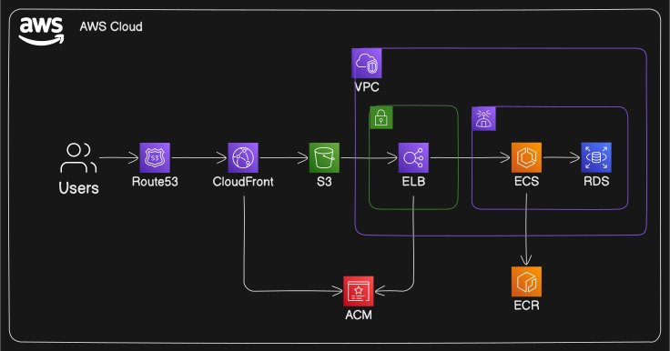

# AWS User Group 🎙️

## Description

This project is a simple Node.js backend and React frontend application, deployed to AWS. It's designed as a multi-tenancy system where each tenant is completely isolated in a separate AWS account. One of the key features is a GitHub workflow that creates an ephemeral environment based on a pull request. This allows us to verify the state of the environment before merging the pull request. Once the pull request is merged, the ephemeral environment is shut down.

## Ephemeral Environments process flow

## Cloud resources for each tenant

## Technical frameworks 🛠️

### Terraform 🏗️

Terraform is an open-source tool that we use for building, changing, and versioning infrastructure safely and efficiently.

### TerraGrunt 🌐

TerraGrunt is a thin wrapper for Terraform that provides extra tools for working with multiple Terraform modules.

### GitHub Actions 🔄

We use GitHub Actions for continuous integration and deployment of our AWS resources.
